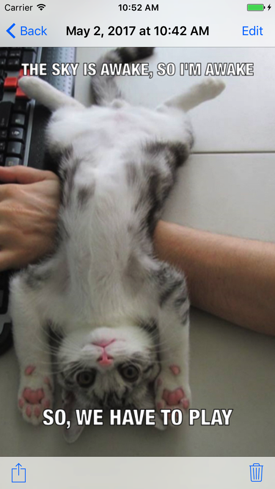

# Meme Me 
You can use this iOS app to generate a meme out of friends, family, or pets.

## Overview
MemeMe is a meme generating app that enables a user to attach a caption to a picture from their phone. After adding text to an image chosen from the Photo Album or Camera and saving it to the phone using Core Data.

Later, the user can view, edit, delete, and even share the meme with friends. And view the memes in a table, and a grid as well.

The app works fine for iPhones and iPads (check the master-universal branch), and also accommodates to the multitasking feature for the large iPads.

## Screenshots
iPhone 7 screenshots:  
 

 

  

iPad Pro (9.7 inch) screenshots (check the  master-universal branch):  
 
 

## Additional Screenshots
   
    

## License
See [LICENSE](LICENSE)
